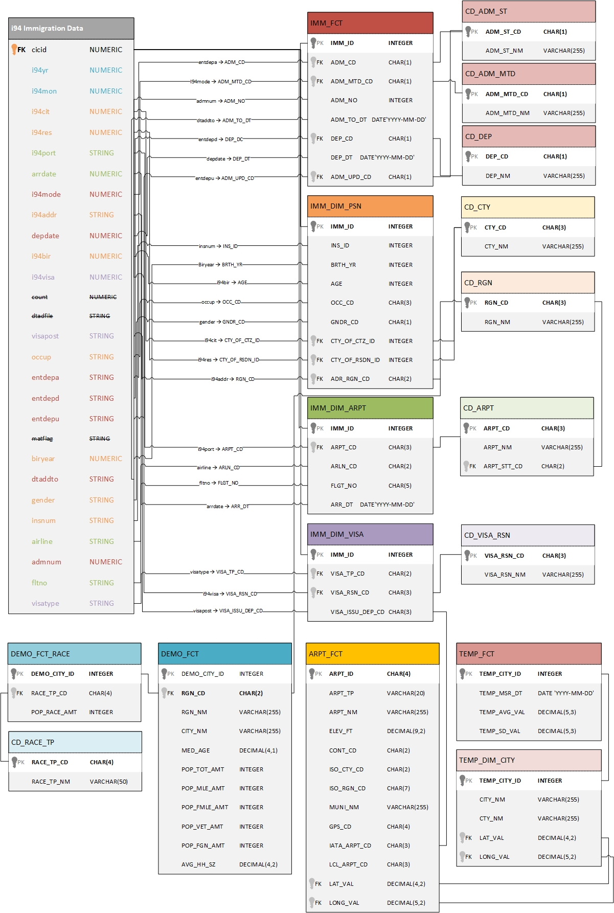

# Purpose
In this project, we build an etl pipeline that extracts data residing in S3, transforms that data, and loads it into a star schema designed for flexible querying. Ultimately, we are building a data model that will give the client easy access to query their data. The client here may be anyone with an interest in immigration data, and the end purpose is to allow the client's analytics team to query the data ad hoc for simple analyses, or to integrate the data in a bigger flow to support automated analyses.

# Background
The data provided consists of a main, denormalised immigration data table, and supporting tables that hold data on airports, world temperature, and demographics in US cities, respectively. We are tasked to build an ETL pipeline that extracts this data from SAS and CSV files, normalise that data, perform quality controls on it, and then load it into a set of dimensional and fact tables for future querying.

# Data model
The data model covers sourcing data from local files and normalising it by structuring the data into a star schema. At present, the data from the respective tables do not seem to be relatable, so we will get four data models, 1 for the immigration data that gets normalised, and three for the remaining source tables.

The immigration data model in this project will follow a star schema consisting of admission data in a fact table and four dimension tables to support the fact table. The common key for all tables will be `cicid` to be renamed `IMM_ID` for all tables. It is suggested that the model develop into a Snowflake Schema with translation of all `CD`-fields in each table. This design will be outside the scope of this project.

## Immigration Data

### Fact table
The fact table holds facts about admission to the US as well as departure from the country in addition to method travelled to the country. Through the IMM_ID (immigration ID), we can learn about the person immigrating, the arrival (assuming the person flew in), and the VISA.

### Dimension tables

#### Visa Dimension table
Describes conditions for VISA application and holds four fields:
0. IMM_ID: Primary key connecting to fact table.
1. VISA_TP_CD: Class of admission legally admitting the non-immigrant to temporarily stay in U.S.
2. VISA_RSN_CD: Visa codes collapsed into three categories (Business Pleasure, Student).
3. VISA_ISSU_DEP_CD: Code for Department of State where where Visa was issued.

#### Person Dimension table
Describes the immigrant arriving into the US and holds nine fields:
0. IMM_ID: Primary key connecting to fact table.
1. INS_ID: Insurance ID if any.
2. BRTH_YR: Year of birth.
3. AGE: Age in years.
4. OCC_CD: Code for occupation.
5. GNDR_CD: Code for gender, defined as non-immigrant sex.
6. CITY_ID: City ID of arrival city.
7. RSDN_ID: City ID of residence city in US.
8. RGN_CD: Teo-letter region CD of arrival city (mainly US states).

#### Arrival Dimension table
Describes the arrival information into the US assuming immigrant arrived by air, and holds five fields:
0. IMM_ID: Primary key connecting to fact table.
1. ARPT_CD: Code of airport of arrival.
2. ARLN_CD: Code of airline of arrival.
3. FLGT_NO: Number of flight of arrival.
4. ARR_DT: Date of arrival. Note this is different from admission date which is found in the Fact table.

# Source Files
The data used in this project resides in S3 and is separated into log (event) and metasong data. The logs on user activity (events) on the app are stored in one directory of JSON files, and metadata on the songs in their app is stored in a separate directory of JSON files. Please see header "Table diagram" for the content of the log and song data tables.

- I94 Immigration Data: This data comes from the US National Tourism and Trade Office and is stored in a .sas7bdat-file.
- World Temperature Data: This dataset came from Kaggle. This data resides in a .csv-file. You can read more about it here.
- U.S. City Demographic Data: This data comes from OpenSoft. This data resides in a .csv-file. You can read more about it here.
- Airport Code Table: This is a simple table of airport codes and corresponding cities. This data resides in a .csv-file. It comes from here.

# Implementation
The setup requires an IAM user in AWS that allows to store the data into an S3 cluster after transformations from their local files. Additionally, the program is written in pyspark to allow for big data manipulation. All transformations of data ultimately lead to creating the tables for the star schema and writing parquet files to the S3 cluster. The final product is shown in the "table diagram" header below.

# Table creation and population
By reading the data from the json files, we will store these in temporary tables, transform them and upload the final data to a directory in an S3 cluster of our choice. Beware that the IAM user must have write access to that cluster.
